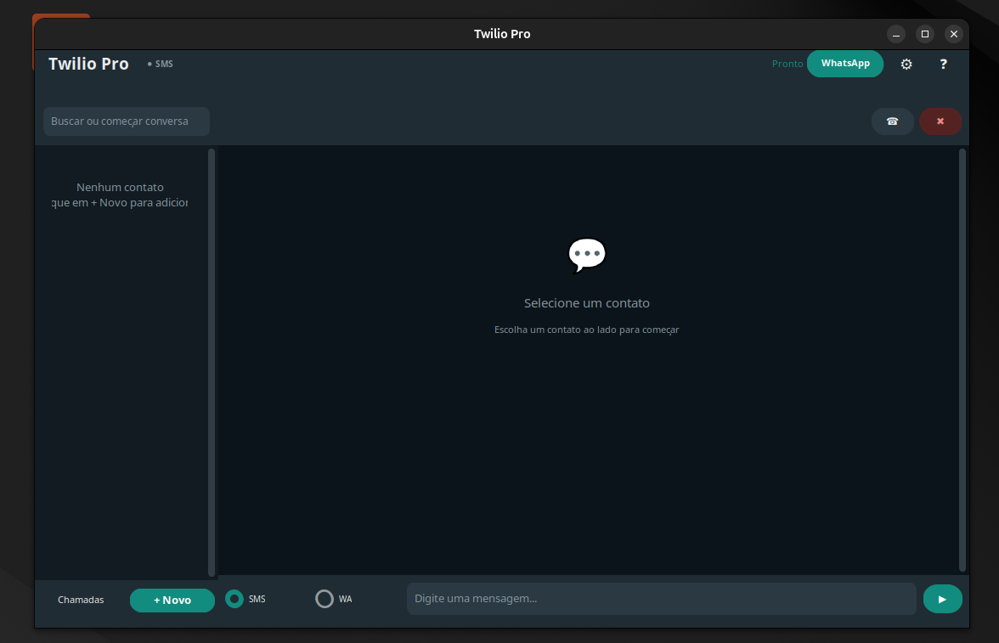

# Twilio Pro

Aplicativo desktop estilo WhatsApp para envio de SMS e WhatsApp via API Twilio, com gerenciamento de contatos, chamadas simuladas e configuração interna.


## Funcionalidades

- **Mensagens SMS/WhatsApp** — Envio direto via API Twilio com indicadores de status (enviado, entregue, falha)
- **Interface WhatsApp Theme** — Tema escuro profissional com bolhas de mensagem, avatares coloridos e contador de caracteres SMS
- **Gerenciamento de Contatos** — CRUD completo com busca, avatar com iniciais e preview da última mensagem
- **Chamadas Simuladas** — Registro de chamadas com duração aleatória e histórico
- **Configuração Interna** — Edite todas as variáveis do `.env` diretamente pela interface (engrenagem)
- **Wizard WhatsApp** — Compre números virtuais e verifique seu WhatsApp passo a passo
- **Sistema de Toast** — Notificações coloridas de sucesso, erro, aviso e informação
- **Diálogo de Ajuda** — Guia completo de configuração embutido no app
- **Segurança** — Login com senha (definida no `.env`) na inicialização

## Captura de Tela



## Pré-requisitos

- Python 3.10+
- Conta na [Twilio](https://twilio.com) com número habilitado para SMS
- (Opcional) ChromeDriver para automação Selenium

## Instalação

```bash
git clone https://github.com/gregorioponciano/twilio.git
cd twilio
python3 -m venv venv
source venv/bin/activate
pip install -r requirements.txt
```

## Configuração

Copie o arquivo de exemplo e edite com suas credenciais:

```bash
cp .env.example .env
```

Edite o `.env` com suas informações:

| Variável | Obrigatório | Descrição |
|:---|---:|:---|
| `TWILIO_ACCOUNT_SID` | Sim | SID da sua conta Twilio |
| `TWILIO_AUTH_TOKEN` | Sim | Token de autenticação Twilio |
| `TWILIO_NUMBER` | Sim | Número de origem (+5511999999999) |
| `APP_PASSWORD` | Não | Senha para login no app |
| `PRIMARY_PHONE` | Não | Seu telefone pessoal |

As demais variáveis (provedores, e-mail, Chrome, internas) são opcionais e podem ser configuradas pela interface.

## Uso

```bash
python3 main.py
```

Na primeira execução:
1. Se `APP_PASSWORD` estiver definida, informe a senha
2. Clique em **WhatsApp** na barra superior para configurar número virtual e verificação
3. Use **+ Novo Contato** para adicionar contatos
4. Selecione um contato, digite a mensagem e pressione **Enter**

### Atalhos

| Tecla | Ação |
|:---|---:|
| `Enter` | Enviar mensagem |
| `Escape` | Focar no campo de mensagem |

## Estrutura do Projeto

```
twilio/
├── main.py                        # Ponto de entrada
├── .env                           # Configurações (gitignorado)
├── .env.example                   # Exemplo de configuração
├── requirements.txt               # Dependências
├── README.md
├── data/                          # Dados gerados em runtime (gitignorado)
│   ├── twilio.db                  # SQLite (contatos, mensagens, chamadas)
│   └── .whatsapp_verified         # Marcador de verificação WhatsApp
└── src/
    ├── config.py                  # Leitura do .env
    ├── database.py                # Conexão SQLite singleton
    ├── exceptions.py              # Exceções personalizadas
    ├── manager.py                 # Gerenciador de números virtuais
    ├── models.py                  # Dataclasses (Contact, Message, CallLog)
    ├── receiver.py                # Polling de SMS recebido
    ├── repository.py              # CRUD SQLite
    ├── sender.py                  # Envio via Twilio API
    └── gui/
        ├── app.py                 # Classe App (CTk root)
        ├── styles.py              # Cores, fontes, dimensões, helpers
        ├── chat_view.py           # Área de mensagens com bolhas
        ├── contact_list.py        # Painel lateral de contatos
        ├── call_log_view.py       # Histórico de chamadas
        ├── dialogs.py             # Diálogo de novo/editar contato
        ├── settings_dialog.py     # Edição do .env
        ├── setup_wizard.py        # Wizard de WhatsApp
        └── help_dialog.py         # Guia de configuração
```

## Tecnologias

- **[CustomTkinter](https://github.com/TomSchimansky/CustomTkinter)** — UI moderna com tema escuro nativo
- **[Twilio](https://www.twilio.com/docs)** — API de SMS/WhatsApp
- **[python-dotenv](https://github.com/theskumar/python-dotenv)** — Gerenciamento de configurações
- **SQLite** — Persistência local via sqlite3

## Licença

MIT
